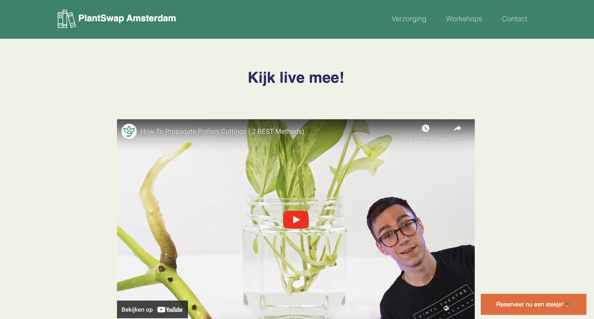
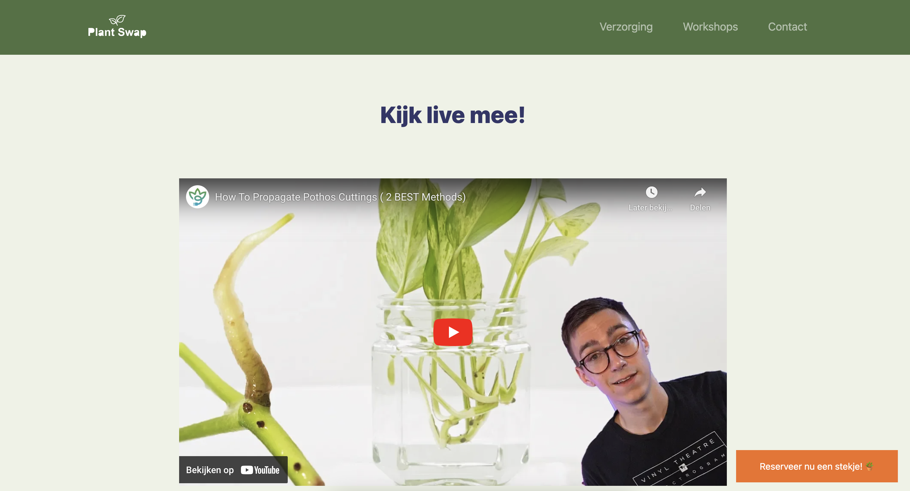

> _Fork_ deze leertaak en ga aan de slag. Onderstaande outline ga je gedurende deze taak in jouw eigen GitHub omgeving uitwerken. De instructie vind je, zoals altijd, in: [docs/INSTRUCTIONS.md](docs/INSTRUCTIONS.md)

# Titel
Corporate identity

## Inhoudsopgave

  * [Beschrijving](#beschrijving)
  * [Kenmerken](#kenmerken)
  * [Bronnen](#bronnen)
  * [Licentie](#licentie)

## Beschrijving
<!-- In de Beschrijving staat hoe je project er uit ziet, hoe het werkt en wat je er mee kan. -->
Aan ons was de opdracht om met alle projectleden van Buurtcampus Oost een living styleguide te maken. En deze toe te passen op je eigen
website. We zijn begonnen met het maken van een interface audit. Hierbij kijk je hoe consistent de huidige huisstijl is van de opdrachtgever en welke huisstijl elementen al in gebruik zijn. Van de interface audit hebben we een living styleguide gemaakt. Dit word ook wel een levende stijlgids genoemd het is een modern huisstijl handboek. Ook is het een live, toegankelijke en semantische verzameling van huisstijl componenten. Ook is de living styleguide altijd up to date, want bij wijzigingen kan deze makkelijk worden aangepast.

De living styleguide van Buurtcampus Oost is te zien via de volgende link:
https://tolga1999.github.io/look-and-feel-living-styleguide/

<!-- Voeg een mooie poster visual toe 📸 -->
Before:


After:


<!-- Voeg een link toe naar Github Pages 🌐-->
Mijn Github-pages:
https://joelle78.github.io/look-and-feel-corporate-identity/

## Kenmerken
<!-- Bij Kenmerken staat welke technieken zijn gebruikt en hoe. Wat is de HTML structuur? Wat zijn de belangrijkste dingen in CSS? Wat is er met Javascript gedaan en hoe? Misschien heb je een framework of library gebruikt? -->
Om een waarde aan een CSS-variabel te geven heb ik de: var() Function gebruikt. Deze heb ik toegepast op kleuren en font-sizes. Custom properties zorgen ervoor dat de waarden op een plaats worden opgeslagen, en vervolgens op meerdere plaatsen kan worden toegepast. Het is makkelijker om --orange te begrijpen dan #ef672e;.

```
:root {
  /* COLORS */
  --green: #4E7141; /*158467*/
  --broken-white: #EEF2E6;
  --purple-blue: #333568;
  --orange: #f26f20;
  --white: #fff;
  --dark-white: #ddd;
  --grey: #f1f1f1;
  --black: #000000;

  /* FONT SIZES */
  --small: 1.2rem;
  --medium: 1.5rem;
  --large: 2.5rem;

  /* RESPONSIVE FONT SIZES */
  --small-resp: 1vw;
  --normal-resp: 2vw;
  --medium-resp: 2.5vw;
  --large-resp: 3vw;
}

```

## Bronnen
https://tolga1999.github.io/look-and-feel-living-styleguide/<br>
https://developer.mozilla.org/en-US/docs/Web/CSS/:root<br>
https://www.decathlon.design/726f8c765/p/75e137-digital-overview<br>

## Licentie


This work is licensed under [GNU GPLv3](./LICENSE).
